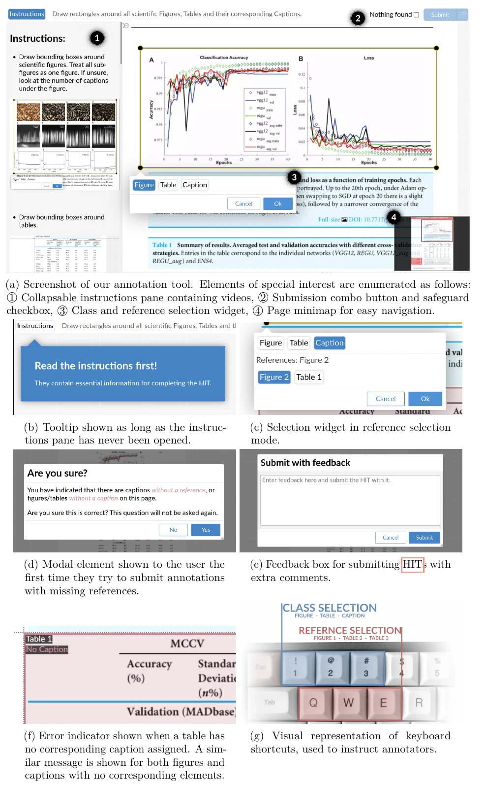

# Sci-Annot Frontend Annotation Tool
An tool for annotating figures, tables and captions in scientific publications.

It can be used in Amazon Mechanical Turk or hosted as a standalone tool, though in both cases, a separate back-end for storing annotations is needed.
An example of such back-end system is [HITMaker](https://github.com/Dzeri96/sci-annot-HITmaker), which uses this tool for annotation review, editing and creation.

It is built on top of [annotorious-openseadragon](https://github.com/annotorious/annotorious-openseadragon) and uses the [W3C Annotation Model](https://www.w3.org/TR/annotation-model/) to store annotations, though the schema itself is custom-built.
## Features
Below is a screenshot of some notable features of this tool, taken from my master's thesis.


When no image URL is supplied, this tool shows a test page.
This enables you to quickly evaluate the interface without having to load anything.
Just `npm run serve` and go!

Some other quality-of-life features include:
- The build version is always included in the submission, making it easy to correlate changes in the interface to the changes in submissions.
- The time since an image is loaded is included in the submission.
This enables tracking of work times per submission. 

## Query Parameters
This tool's behavior is guided by different query parameters.
This is a consequence of making it compatible with Mechanical Turk.
Everything being so complicated is a consequence of me extending the tool to work with HITmaker (and standalone) over time.

Here's a possibly incomplete list of query parameters and how they work:

- `assignmentId` - Injected by MTurk so that the worker's submission can be tracked.
It is passed along with the annotations to the submit endpoint (amazon or yours).
When this parameter is not set, which happens in MTurk's preview mode, the submit function is disabled, and the tutorial image is shown.

- `assignmentUrl` - Takes precedence over `assignmentId` and signifies that an assignment (annotations + metadata) should be fetched from this URL.
This is used by HITMaker to allow the editing of annotations.
When this parameter is set, the `assignmentId` is set to `ADMIN_ASSIGNMENT`, to signify that the task "administrator" submitted the annotation.
This also overrides `turkSubmitTo` as the URL for annotation submission.

- `turkSubmitTo` - Injected by MTurk as the URL for submitting assignments.

- `image` - The URL to fetch the image (page to be annotated) from. Used if not in tutorial mode.
The image dimensions are extracted and included in the submission.

- `comment` - Injected by MTurk if the HITs were created with a comment.

- `csrf_token` - The Cross Site Request Forgery (CSRF) token, passed by HITMaker.
Sorry for the snake case.

## Project setup
```
npm install
```

### Compiles and hot-reloads for development
```
npm run serve
```

### Compiles and minifies for production
```
npm run build
```

### Lints and fixes files
```
npm run lint
```

### Customize configuration
See [Configuration Reference](https://cli.vuejs.org/config/).